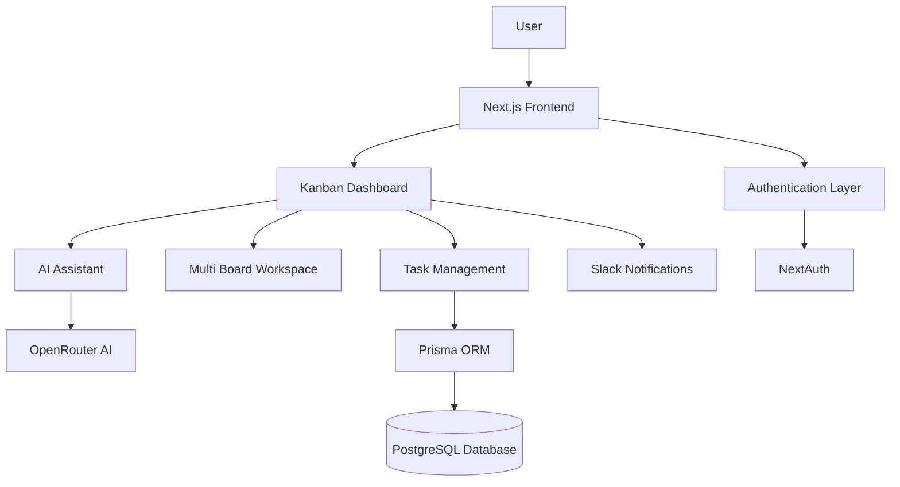

# Forge Sprint 02 – AI-Powered Kanban Platform

<p align="center">
  Modern AI-powered Kanban Board with Authentication, Multi-Board Workspaces, AI Task Intelligence, Slack Notifications, and Production-Ready Deployment.
</p>

<p align="center">
  <a href="https://forge-sprint-02-kanban-862c.vercel.app/login"><strong>Live Demo</strong></a>
  |
  <a href="https://github.com/gagandeepsingh76/forge-sprint-02-kanban"><strong>Repository</strong></a>
</p>

<p align="center">
  
  
  
  
  
  
  
</p>

---

## Overview

Forge Sprint 02 is a production-ready AI-powered Kanban Project Management Platform built with Next.js 16, TypeScript, PostgreSQL, Prisma ORM, OpenRouter AI integration, Slack notifications, Docker support, and GitHub Actions CI/CD.

The platform enables users and teams to organize projects, manage tasks, automate planning with AI, and improve productivity through intelligent workflows.

---

## Live Demo

### Production Deployment

https://forge-sprint-02-kanban-862c.vercel.app/login

---

## GitHub Repository

### Source Code

https://github.com/gagandeepsingh76/forge-sprint-02-kanban

---

## Product Screenshots

### Login Page


---

### Dashboard


---

### Multi-Board Workspace


---

### AI Assistant Panel

> Add Screenshot Here

---

### Task Management Interface


---

## Why Forge Sprint 02?

Managing projects across multiple boards, priorities, deadlines, and teams often becomes difficult without intelligent planning tools.

Forge Sprint 02 combines modern Kanban workflows with AI-powered assistance to help users:

* Organize tasks efficiently
* Break down complex work automatically
* Prioritize tasks intelligently
* Track progress visually
* Manage multiple project boards
* Receive automated notifications
* Maintain productivity with minimal manual effort

---

## Core Features

### Authentication

* Secure User Registration
* Login & Logout
* Protected Routes
* Session Management
* Credential-Based Authentication
* Database-Persisted Users

### Kanban Management

* Create Tasks
* Edit Tasks
* Delete Tasks
* Drag-and-Drop Functionality
* Status Tracking
* Todo Management
* In Progress Tracking
* Completed Task Tracking

### Multi-Board Workspaces

* Create Boards
* Rename Boards
* Delete Boards
* Switch Between Boards
* Board Persistence

### AI Features

* AI Task Generation
* AI Task Breakdown
* AI Prioritization
* Smart Planning Assistance
* OpenRouter Integration
* Structured AI Responses

### Notifications

* Slack Webhook Integration
* Task Creation Alerts
* Task Completion Notifications
* Board Activity Updates

### User Experience

* Responsive Design
* Dark Mode
* Light Mode
* Mobile-Friendly Interface
* Modern Dashboard UI
* Real-Time Interactions

---

## System Architecture



---

## Technology Stack

| Layer            | Technology     |
| ---------------- | -------------- |
| Frontend         | Next.js 16     |
| Language         | TypeScript     |
| Styling          | Tailwind CSS   |
| Database         | PostgreSQL     |
| ORM              | Prisma         |
| Authentication   | NextAuth       |
| AI Provider      | OpenRouter     |
| Notifications    | Slack Webhooks |
| Hosting          | Vercel         |
| CI/CD            | GitHub Actions |
| Containerization | Docker         |

---

## Project Structure

```text
forge-sprint-02-kanban/

├── src/
│   ├── app/
│   ├── components/
│   ├── hooks/
│   ├── lib/
│   ├── data/
│   ├── types/
│   └── validations/
│
├── prisma/
│   ├── schema.prisma
│   └── migrations/
│
├── public/
│
├── tests/
│
├── .github/
│   └── workflows/
│
├── Dockerfile
├── docker-compose.yml
├── README.md
└── package.json
```

---

## AI Capabilities

### Generate Tasks

Automatically generate project tasks from goals and descriptions.

### Break Down Tasks

Convert large tasks into actionable subtasks.

### Prioritize Work

Identify the most important work first.

### Planning Assistance

Receive AI-powered planning recommendations.

---

## Slack Integration

Slack notifications are supported for:

* Board Creation
* Task Creation
* Task Updates
* Task Completion
* Workspace Activity

---

## Database

PostgreSQL + Prisma ORM

Supports:

* User Accounts
* Authentication Data
* Board Storage
* Task Persistence
* Workspace Data

---

## Environment Variables

```env
DATABASE_URL=

NEXTAUTH_SECRET=

NEXTAUTH_URL=

LOG_LEVEL=info

OPENROUTER_API_KEY=

SLACK_WEBHOOK_URL=
```

---

## Local Setup

Clone Repository

```bash
git clone https://github.com/gagandeepsingh76/forge-sprint-02-kanban.git

cd forge-sprint-02-kanban
```

Install Dependencies

```bash
npm install
```

Generate Prisma Client

```bash
npx prisma generate
```

Push Database Schema

```bash
npx prisma db push
```

Run Development Server

```bash
npm run dev
```

Open:

```text
http://localhost:3000
```

---

## Docker Setup

Build and Run

```bash
docker compose up --build
```

Stop Containers

```bash
docker compose down
```

---

## Deployment

### Vercel

1. Import GitHub Repository
2. Configure Environment Variables
3. Connect PostgreSQL Database
4. Deploy

### Required Environment Variables

```env
DATABASE_URL
NEXTAUTH_SECRET
NEXTAUTH_URL
LOG_LEVEL
OPENROUTER_API_KEY
SLACK_WEBHOOK_URL
```

---

## Testing

Lint

```bash
npm run lint
```

Run Tests

```bash
npm test
```

Production Build

```bash
npm run build
```

---

## CI/CD

GitHub Actions Workflow Includes:

* Lint Checks
* Automated Testing
* Production Builds
* Deployment Validation

---

## Future Improvements

* Team Collaboration
* Role-Based Access Control
* Real-Time Updates
* Calendar View
* Gantt Charts
* File Attachments
* AI Analytics Dashboard
* Project Insights
* Mobile Application

---

## Deployment Status

| Service        | Platform        | Status |
| -------------- | --------------- | ------ |
| Frontend       | Vercel          | Live   |
| Database       | Neon PostgreSQL | Active |
| Authentication | NextAuth        | Active |
| AI Services    | OpenRouter      | Active |
| Notifications  | Slack           | Active |

---

## Author

### Gagandeep Singh

B.Tech IT

GitHub:
https://github.com/gagandeepsingh76

LinkedIn:
https://www.linkedin.com/in/gagandeep-singh

---

## License

This project is licensed under the MIT License.
